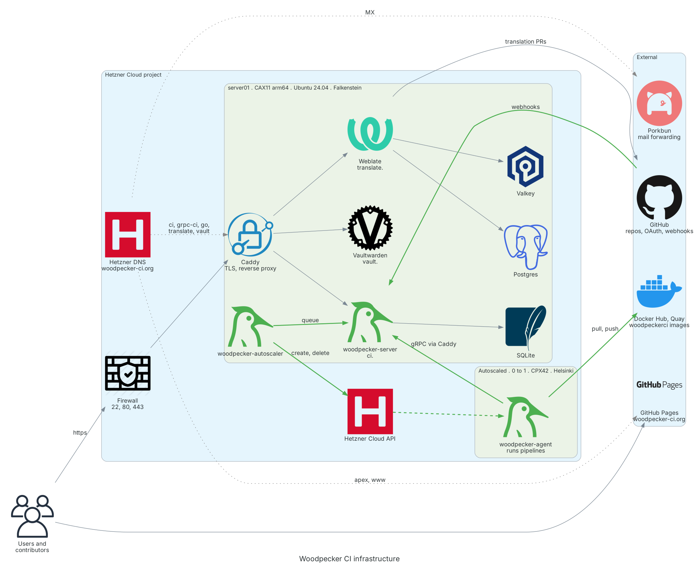
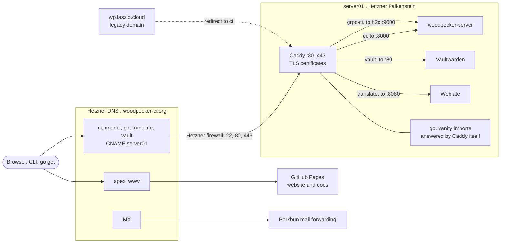
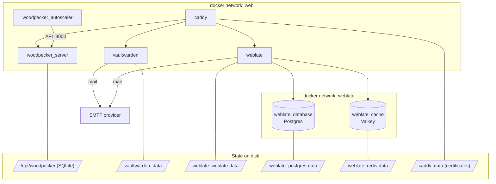
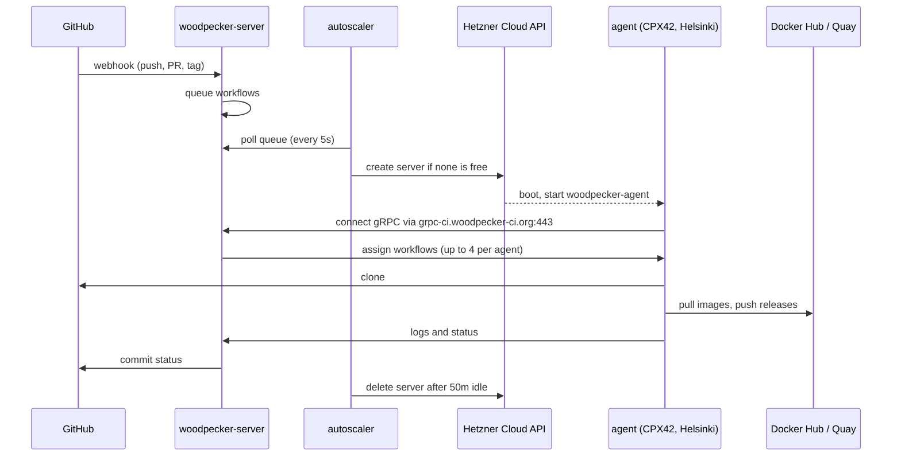
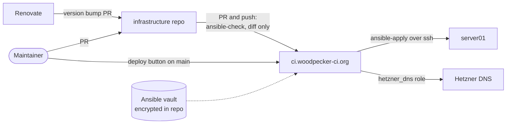

# Infrastructure overview

Everything the Woodpecker CI project runs and has to maintain. The Ansible code in this repo is the source of truth, this page is the map to it.

<!-- TODO: add a "Backups" section and show them in overview/overview.py once backups are implemented (none exist yet). -->

## The big picture

Generated from [`overview/overview.py`](overview/overview.py). Do not edit the image, change the script and run `python3 overview/overview.py` (needs Graphviz and `pip install diagrams`).

In short:

- One small Hetzner Cloud server (`server01`) runs everything permanent as Docker containers behind Caddy.
- Pipelines do not run on that server. The autoscaler creates a bigger Hetzner server when work is queued and deletes it again when idle.
- The website and mail are not on our servers at all: GitHub Pages and Porkbun.

The sections below zoom into one question each.

## Who answers which hostname

All DNS records of `woodpecker-ci.org` live in Hetzner DNS and are managed by the `hetzner_dns` role.

`wp.laszlo.cloud` was the URL of the original project creator. The redirect stays as long as that domain points to us.

## What runs on server01

`server01` is a Hetzner `CAX11` (arm64, 2 vCPU, 4 GB RAM, 40 GB disk) with Ubuntu 24.04. Every service is one Ansible role and one or more Docker containers.

Also on the host: a daily `docker system prune` timer and a `reboot` cron pipeline.

## How a pipeline runs

No agent runs permanently. The autoscaler keeps between 0 and 1 agents on Hetzner `CPX42` servers in Helsinki.

## How changes get deployed

This repo deploys itself through the CI server it manages.

Local runs are possible too, see the [README](README.md).

## Outside of Ansible

Things we depend on that this repo does not manage. Who owns and can access them is listed in [GOVERNANCE.md](https://github.com/woodpecker-ci/.github/blob/main/GOVERNANCE.md).

| What                | Used for                                      |
| ------------------- | --------------------------------------------- |
| GitHub org          | Source code, OAuth login for CI, webhooks     |
| GitHub Pages        | Website and docs (`woodpecker-ci.org`, `www`) |
| Docker Hub and Quay | Published `woodpeckerci` images               |
| Codeberg orgs       | `woodpecker-ci` and `woodpecker-plugins`      |
| Porkbun             | Mail forwarding for `@woodpecker-ci.org`      |
| SMTP provider       | Outgoing mail of Weblate and Vaultwarden      |
| Hetzner firewalls   | Allow 22, 80 and 443 to `server01`            |
| Renovate            | Dependency and image update PRs               |
| OpenCollective      | Donations                                     |
| Domain registration | `woodpecker-ci.org`                           |
